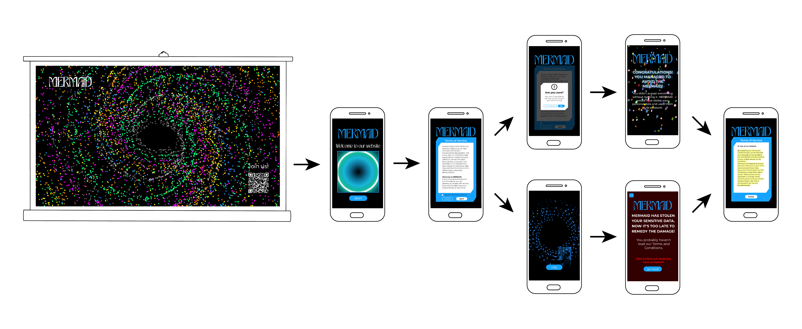
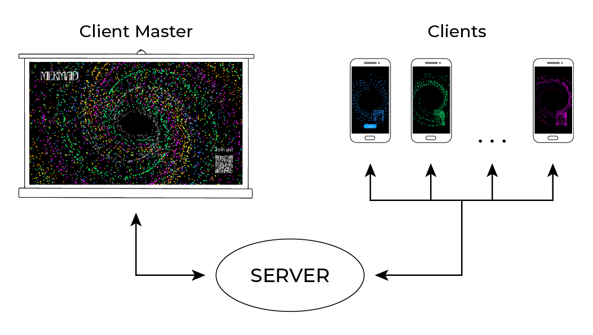

<br>

# **About**
Mermaid is a digital exhibition built on p5.js with the aim of raising awareness of acceptance of the terms and conditions of use we encounter on the web. <br>
Mermaid was developed as a part of the Creative Coding course at Politecnico di Milano.

# **Table of Contents**
 1. ### [Project idea](#project-idea)
    * Theme
    * Aim
    * Concept
 2. ### [Structure and interaction](#structure-and-interaction)
 3. ### [Design](#Design)
 3. ### [Code](#code)
    * Visual aspects
    * Coding challenges
    * References and tutorials
 4. ### [Team](#team)

# **Project idea**

## **Theme**

The project is inspired by the theme of *presence*. In a world in which technology is rendered invisible and intangible, the challenge was to be able to highlight invisible steps that we fail to notice in our daily interaction with it. 

## **Aim**

We have interpreted this concept of making visible what we cannot grasp with passive acceptance of the **Terms and Conditions of use** required to access any kind of online service. Most people do not read what they agreed to use the applications. Our goal with Mermaid is to make users think about the personal information they upload on the Internet every day. Mermaid wants to highlight the inability of the users to control their personal data by agreeing to share them with third parties.

## **Concept**

The name Mermaid comes from Greek mythology, where mermaids were bewitchers because of their good looks and voices, but at the same time they were also misleading because their goal was to lure visitors and then kill them. We transposed this concept to our project, where online services represent mermaids. The users can interact with Mermaid only after having accepted its Terms and Conditions. In this Terms and Conditions, the users will be notified that their data is about to be stolen and will no longer be under their control. After having accepted this terms, users' camera and microphone data are going to be used by Mermaid, showing them in the projector representation. 

# **Structure and interaction**

<br>

The project is composed by: <br>

1. **The representation on the projector:**  a p5.js sketch of a spiral made with the data that comes from every client that is going to connect to this project. Every client is associated with a color that is shown in the spiral. In this page there's also the "song of Mermaid", which consists of a melody and the sounds that Mermaid "steals" from users' microphones. In this representation on the projector there is a QR code which allows users to interact with Mermaid (to make the experience more usable, the maximum number of users who can connect at the same time is set at 5); 

2. **The mermaid interface:** when the user scans the QR code in his device will appear the first HTML page of Mermaid. A pop up with the Terms and Conditions will be shown, with two possible options:

      * **The user clicks "Disagree"** - another pop up asking "Are you sure you don't want to be a part of the Mermaid's community?" will appear. 

         * If the user clicks "No", the pop up will be closed and the sketch will return to the Terms and Conditions webpage.

         * if the user clicks "Yes" he will be redirected to a new HTML page, where the data theft that Mermaid allegedly tried to commit against him is made explicit and he is asked if he would like to go on and read again what the Terms and Conditions said.

          * By clicking the "Go read" button the user will go to an HTML page similar to the first Terms and Conditions page but with the part that describes the project and the aim of Mermaid highlighted.

      * **The user clicks "Agree"** - Mermaid starts to steal data. The user will be taken to a p5.js sketch where he'll see his camera captured and transformed in little circles, that represent every different data. After a while the camera representation is going to create a spiral, similar to the big spiral on the projector. The spiral has a precise color, different from every user that is connected at the same time. Data are stolen and Mermaid has the control over them. After the user realizes that his data are going on the main screen, an "info" button will appear. If the user clicks it, he will be notified of the data theft, and he will be asked if he wants to go back and read properly what he agreed to. If he decides to go back, he will be taken to an HTML page similar to the first Terms and Conditions page but with the part that describes the project and the aim of Mermaid highlighted.

# **Design**
Mermaid has a mysterious, mystical style that perfectly embodies the initial enigmatic nature of the project.
For the logo of Mermaid, we chose a logotype made with the font Armouk Regular. This font is sinuous, soft and remembers the waves of the sea.

[SPAZIO PER LOGO E FONT ARMOUK] <br>

For the other texts of Mermaid, we chose the font Montserrat, a simple
sans serif font with strong readability.

[SPAZIO PER FONT MONTSERRAT] <br>

First of all, we wanted the colors of the spirals to be all shades of Mermaid's color; we later realized that this made it difficult to distinguish the different data in the main spiral, so we decided to choose very different colors so that the distinction would be sharp.

<br>

# **Code**

## **Visual aspect**
MAIN SPIRAL

<br>

The main spiral was created through generative art. To create each spiral we used a class called `Star`. The class contains parameters that allow a subsequent algorithm to rotate the circles forming the spiral. The `update` function allows a continuous rotation.

```javascript
// Star (spiral) class definition
class Star {
  constructor(majorAxisLen) {
    this.majorAxisLen = majorAxisLen;
    this.minorAxisLen = majorAxisLen * widthHeightRatio;
    this.theta = random(2 * PI);
    this.deltaTheta = 0.02;
  }

  display() {   // display the spiral with the color associated to the specific client with client specific random value for position
    const x = (this.majorAxisLen / 2) * cos(this.theta);
    const y = (this.minorAxisLen / 2) * sin(this.theta);

    noStroke();
    fill(255, 255, 255, 100);
    circle(x, y, 4);

      for (let i = 1; i < 6; i++) {
        if (disconnected_client[i] != 1) {   // if the client is disconnected do not create the spiral
          fill(client_color_list[i]);
          circle(x * random_value[i], y * random_value[i], 4);
        }
      }
  }

  update() {   // spiral rotation generation
    this.theta += this.deltaTheta;
  }
}
```

The main spiral is accompanied by a background sound, which resembles to a mermaid's song.

```javascript
// preload of background sound
function preload() {
  song = loadSound('./libraries/MermaidSong.mp3');
}

// setup the artboard
function setup() {

 [...]

  song.play(); // start playing
  song.loop(); // loop the audio
  userStartAudio(); // enable audio
  song.setVolume(0.5); // change the volume of the sound file
}
```
USER'S SPIRAL

<br>

To obtain every circle of this spiral, we used a function called `pointCalculator` that is launched for every point through two `loop`. `pointCalculator` takes the video's pixel and calculates the x and y of every corrispondent circle. The radius of the circle depends on the distance of the user from the camera. 

```javascript
function draw() {
   
   [...]

    //static image
    for (var y = 0; y < video.height; y++) {
      for (var x = 0; x < video.width; x++) {
        pointCalculator(x, y);
        circle(circleX, circleY, w);
      }
    }

   [...]

   //function that calculates the circles that simulate the camera
function pointCalculator(x, y) {
  index = (video.width - x - 1 + y * video.width) * 4;
  r = video.pixels[index + 0];
  g = video.pixels[index + 1];
  b = video.pixels[index + 2];
  bright = (r + g + b) / 3;
  w = map(bright, 5, 255, 0, vScale);
  circleX = x * 10 + 30;
  circleY = y * 10 + 100;
  return w, circleX, circleY;
}
```
Beside the static image, the user's spiral is made of 3 different representations that rotates at different speeds. The rotations start at different `frameCount`, to allow a distinction of flows and to see particles continuously depart from the static image.

```javascript
//third moving image
    for (var y = 0; y < video.height; y++) {
      for (var x = 0; x < video.width; x++) {
        pointCalculator(x, y);
        rotate(rotationGradient3);
        circle(circleX, circleY, w);
      }

      //start rotation three
      if (frameCount > 900) {
        rotationGradient3 -= 0.00001 + rotationValue;
        rotationValue += 0.00000001;
      }
    }

    //second moving image
    for (var y = 0; y < video.height; y++) {
      for (var x = 0; x < video.width; x++) {
        pointCalculator(x, y);
        rotate(rotationGradient2);
        circle(circleX, circleY, w);
      }

      //start rotation two
      if (frameCount > 600) {
        rotationGradient2 -= 0.00001;
      }
    }

    //first moving image
    for (var y = 0; y < video.height; y++) {
      for (var x = 0; x < video.width; x++) {
        pointCalculator(x, y);
        rotate(rotationGradient);
        circle(circleX, circleY, w);
      }

      //start rotation one
      if (frameCount > 300) {
        rotationGradient -= 0.00001;
      }
    }
```


## **Coding challenges**

SERVER-CLIENT COMMUNICATION

One of the most complex parts we had to deal with was the client-server communication we needed to implement our interactive digital exhibition.

<br>

For the realization of the server, a JavaScript (*server.js*) was created and executed by the framework called *node.js*.

Data is sent between the master client and the other clients via an event driven server, using sockets as the communication channel.

The master client displays the main spiral and receives data from the other clients in the form of further spirals.

The events used are:

1. `connect`  - for client connection
```javascript
// define which function should be called
// when a new connection is opened from client
io.on("connection", newServerConnection);

// callback function: the paramenter (in this case socket)
// will contain all the information on the new connection
function newServerConnection(newSocket) {
  
  if (number_connection < 6){   // check the number of connections. If the number of 5 is exceeded, execute the else instruction
  // log the connection in terminal
  console.log("new connection:", newSocket.id, "Current Connections = ", number_connection, "  Total Connections =", total_connections);
  total_connections = total_connections +1;
  
  for (i=0 ; i<6; i++ ){   // push the user socket id value in users array
    if (users[i] == 0){    // if the users array value is set to 0 there is a new connection
      users[i] = newSocket.id;
      number_connection = number_connection +1;
      let userinfo = {   
        usernum : i,
        userskt : newSocket.id,      }
      io.to(users[i]).emit("sendUserId", userinfo);   // send the user-sequence number information to the user
      i=6;newSocket
    }
  }

[...]

}
```
*server.js*


```javascript
// define the function that will be called on a new newConnection
clientSocket.on("connect", newConnection);

// callback function for "connect" messages
function newConnection() {
  console.log("your id:", clientSocket.id);
}
```
*sketch.js*


```javascript
// define the function that will be called on a new newConnection
clientSocket.on("connect", newConnection);

[...]

// set the random value for spiral creation
function newConnection() {
  myrandom_flag = random(1.2, 3);  
}
```
*clientSpiral.js*


2. `sendUserId` - for client identification, required for unique color association.

```javascript
[...]

let userinfo = {
        usernum : i,
        userskt : newSocket.id,      }
      io.to(users[i]).emit("sendUserId", userinfo); // send the user-sequence number information to the user

[...]
```
*server.js*


```javascript
// define the function that will be called when the server will send the data (color and random value of the associated spiral) to the client
clientSocket.on("sendUserId", receiveUserId);

function receiveUserId(userdata) {
  colornum = userdata.usernum;
  if (userdata.usernum < 6) {
    let connection_parameter = {
      id: clientSocket.id,
      random_flag: myrandom_flag,
      color: colornum,
    };
    valid_usernum = 1;
    clientSocket.emit("client", connection_parameter); // send the client event to comunicate the data
  } else {
    colornum = 999;  // if the connection is exceeded set the colornum to 999 in order to show the message in the draw function
  }
}
```
*clientSpiral.js*


3. `client` - to notify the Master Client of the connection of a new client and its color.

```javascript
// define the function that will be called when the server will send the data (color and random value of the associated spiral) to the client
clientSocket.on("sendUserId", receiveUserId);

function receiveUserId(userdata) {
  colornum = userdata.usernum;
  if (userdata.usernum < 6) {
    let connection_parameter = {
      id: clientSocket.id,
      random_flag: myrandom_flag,
      color: colornum,
    };
    valid_usernum = 1;
    clientSocket.emit("client", connection_parameter); // send the client event to comunicate the data
  } else {
    colornum = 999;  // if the connection is exceeded set the colornum to 999 in order to show the message in the draw function
  }
}
```
*server.js*


```javascript
// callback function for receiving "newclient" data (color and the random value for spiral creation)
clientSocket.on("newclient", newClient);

[...]

// function for receiving client information necessary for spiral creation (color and random value)
function newClient(dataReceived) {
  numclient = dataReceived.color;
  random_value[numclient] = dataReceived.random_flag;
  disconnected_client[numclient] = 0;
  client_color_list[numclient] = colors[numclient];
}
```
*sketch.js*


4. `disconnect and endclient` - to communicate the disconnection of a specific client.

```javascript
// on user disconnect prepare the data to send to the master-client
newSocket.on("disconnect", function (){

    let dclient = {
      cls : newSocket.id,
      uid : user_index,
    }

    users.find((value, index) => {  // find and log the disconnecting user
      //console.log("Visited index ", index, " with value ", value);
      if (value == dclient.cls) {
         dclient.uid = index;
        console.log("Disconnecting User : ", dclient.uid, "  Client ID : ", users[dclient.uid]); 
      }
    });
    
// tell to the master-client (user[0]) that the client disconnected and update the counters
    io.to(users[0]).emit("endclient", dclient);
      console.log("User disconnected : ", newSocket.id);
      newSocket.disconnect(1);
      users[dclient.uid] = 0;
      number_connection = number_connection -1;
    });
```
*server.js*


```javascript
// callback function for client disconnection and associated spiral remove
clientSocket.on("endclient", removeClient);

[...]

// function for take trace of client disconnection
function removeClient(termination_parameter) {
  disconnected_client[termination_parameter.uid] = 1;
}
```
*sketch.js*


5. `voice` - to tell the client master to execute the voice stream, associated to and created by the specific client.

Some browsers require an interaction with the webpage, such as a touch, in order to let the audio start. 

```javascript
// callback function for client disconnection and associated spiral remove
clientSocket.on("endclient", removeClient);

[...]

// function for take trace of client disconnection
function removeClient(termination_parameter) {
  disconnected_client[termination_parameter.uid] = 1;
}
```
*clientSpiral.js*


```javascript
// send the audio to individual socketid (private message)
newSocket.on("audioMessage", function (msg) {
      io.to(users[0]).emit("audioMessage", msg);
    });
```
*server.js*


```javascript
// Define the function called when a new message
// comes from the server with type "audioMessage"
clientSocket.on("audioMessage", function (audioChunks) {

  // convert the audio chunks into a single audio blob
  // by passing the audio chunks array into the Blob constructor
  const audioBlob = new Blob(audioChunks);

  // create a URL that points to that blob
  const audioUrl = URL.createObjectURL(audioBlob);

  // pass the audio URL into the Audio constructor and play it
  const audio = new Audio(audioUrl);
  audio.play();
});
```
*sketch.js*

## **References and tutorials**

[Daniel Shiffman - The coding train](https://thecodingtrain.com/)

[socket.io](https://socket.io)

[OpenProcessing](https://openprocessing.org)

[Medium](https://medium.com)

[Stack Overflow](https://stackoverflow.com)


# **Team**

*Mermaid* was developed by:

Clara Di Bella

Irene Fazzari

Alessandra Palombelli

Elisa Tudisco

**Course**

Creative Coding 2022/23

Politecnico di Milano - Scuola del Design

Faculty: Michele Mauri, Andrea Benedetti, Tommaso Elli.